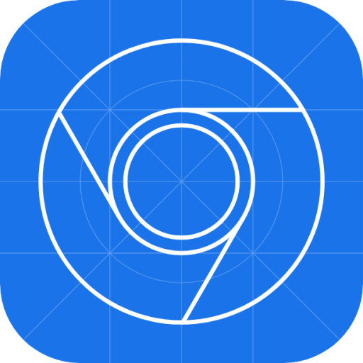
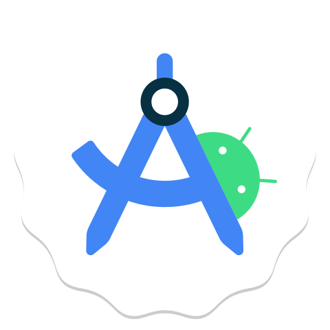
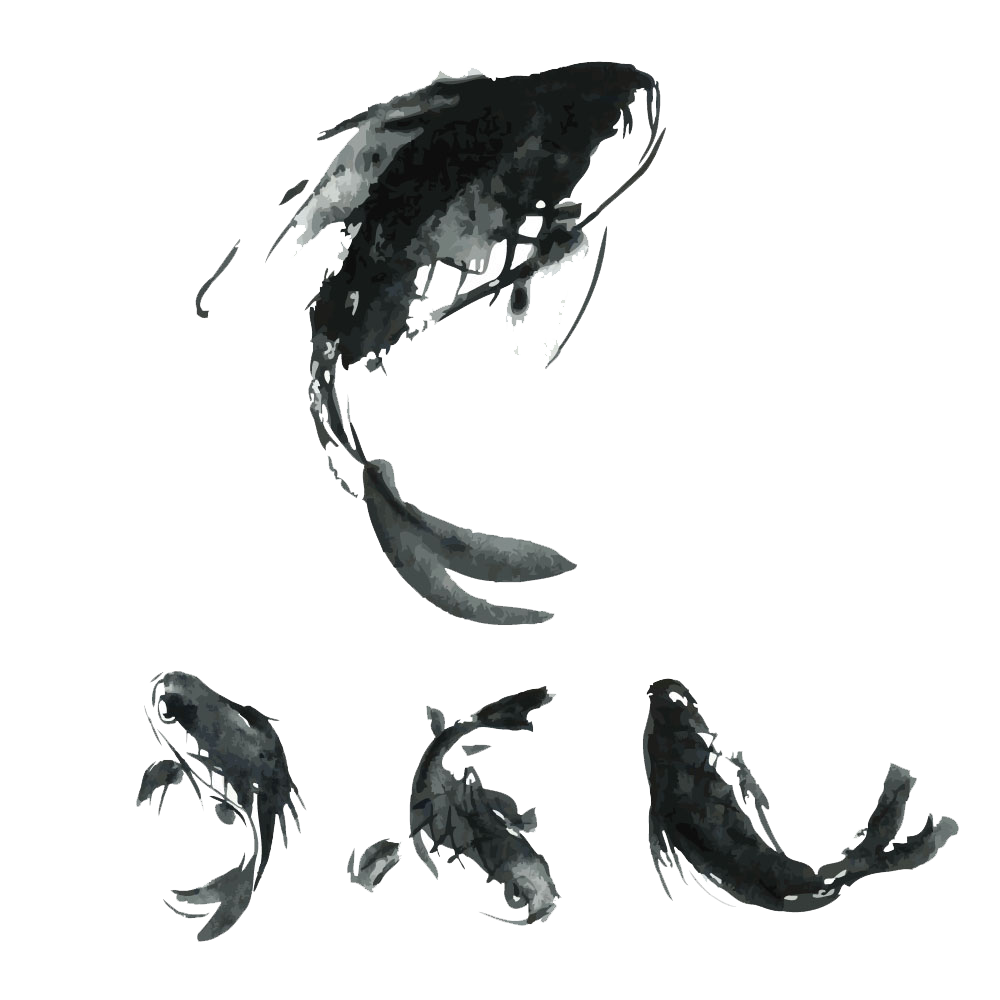

##  Однажды я решил встать на путь QA и теперь я здесь..

Привет! Меня зовут **Непомнящий Анатолий** и я – **Инженер по тестированию ПО**. На данный момент работаю младшим тестировщиком в крупнейшем в РФ IT-интеграторе <a href="https://www.norbit.ru/">«НОРБИТ»</a> (входит в ГК «ЛАНИТ»). Я привержен постоянному совершенствованию своих навыков и здесь вы сможете отслеживать мой прогресс в области обеспечения качества ПО

<a href="https://drive.google.com/file/d/1dutgSNbgSj-Sck-1xzPiNWrv0r04hGCk/view">Резюме QA Непомнящий А.С.</a>   
[upd Июнь 2025]  

##  Мои инструменты и техники

  
  
  
  
  
  
  
  
  
  
  
  
  
  
  
  

  
  
  
  
  
  

  

##  Тестовые артефакты
<ul>
  <li><a href="https://github.com/AnatoliyNepom/Web-application-testing">Тестирование веб-приложения</a></li>
  <li><a href="https://github.com/AnatoliyNepom/API-testing-of-Web-application">Тестирование API</a></li>
  <li><a href="https://github.com/AnatoliyNepom/Data-bases-testing-SQL-NoSQL">Базы данных: MySQL и MongoDB</a></li>
  <li><a href="https://github.com/AnatoliyNepom/Mobile-android-testing">Тестирование мобильного Android-приложения</a></li>
  <li><a href="https://github.com/AnatoliyNepom/Using-CharlesProxy">Работа с анализатором трафика Charles Proxy</a></li>
  <li><a href="https://github.com/AnatoliyNepom/Bash-basic">Базовые команды в bash</a></li>
</ul>  

##  Пройденные курсы
| Курсы                                                           | Дата              |
| ----------------------------------------------------------------| :---------------: |
| rusau.net/ **Функциональное тестирование ПО**                   | 01/2025 - 06/2025 |
| stepik.org/ **Тестирование ПО с нуля. Теория + практика**       | 09/2024 - 06/2025 |
| stepik.org/ **HTML на практике**                                | 04/2025 - 05/2025 |
| Яндекс Практикум Грейд/ **Тестирование мобильных приложений**   | 09/2024 - 10/2024 |
| Яндекс Практикум Грейд/ **Основы тестирования веб-приложений**  | 09/2024 - 10/2024 |
| stepik.org/ **Программирование на Python**                      | 10/2020 - 02/2021 |

##  Изученная литература
- **«Фулстек тестирование»**  
  Гаятри Мохан  

- **«Тестирование программного обеспечения»**  
  Святослав Куликов  
  
- **«Тест-дизайн. Практическое руководство для начинающих»**  
  Ольга Назина

- **«tестирование dot com»**  
  Роман Савин 

---
  

  
  
  

  
